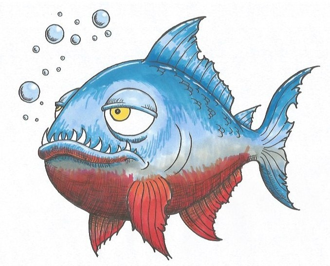

## README page for Pyranha API ##

More to be written as the API is developed.

### Main API calls

```http
GET /pyranha-interaction
```
```http
GET /moods
```
```http
GET /pyranha-interaction/<mood>
```
#


#
## Status Codes
Pyranha API returns the following status codes in its API:

| Status Code | Description |
| :--- | :--- |
| 200 | `OK` |
| 201 | `CREATED` |
| 400 | `BAD REQUEST` |
| 404 | `NOT FOUND` |
| 500 | `INTERNAL SERVER ERROR` |
